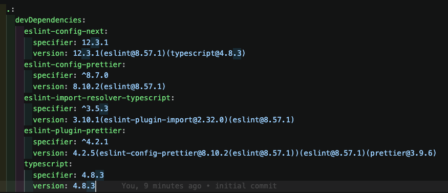
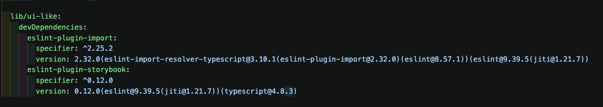
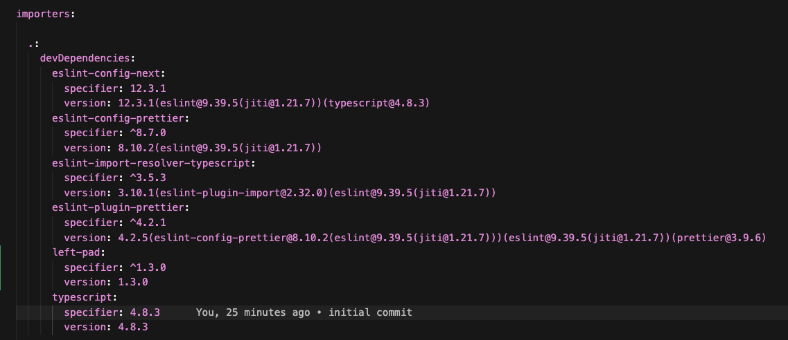

# pnpm auto-install-peers 동작 검증

pnpm 모노레포에서 `auto-install-peers=true`일 때, **아무도 선언하지 않은 패키지의 특정 major 버전이 어떻게 설치되고, 어떻게 peer 범위를 위반하면서까지 전체 워크스페이스로 번지는지**를 단독으로 증명하는 최소 재현이다. 이 폴더만으로 완결되며 외부 저장소·히스토리 참조가 필요 없다.

## 가설

- **H1**: peer 범위 병합(교집합)은 importer(워크스페이스) 단위로 일어난다 — 같은 importer 안에 상한 있는 범위가 하나라도 있으면 그 상한이 이긴다.
- **H2**: 상한 없는 peer 범위(`>=8` 등)만 가진 importer는 단독으로 최신 major를 선택한다.
- **H3 (drift)**: 한번 설치되어 pnpm-lock.yaml에 기록된 버전은, 이후 **그 버전과 무관한 패키지를 하나 추가하는 재설치**만으로도 다른 워크스페이스로 번진다 — 그 워크스페이스가 허용한 peer 범위를 벗어나더라도 경고만 내고 그대로 연결된다.

## 구조

```
.npmrc                     auto-install-peers=true, strict-peer-dependencies=false
pnpm-workspace.yaml        apps/*, lib/*
package.json               루트: eslint-config-next(peer eslint ^7||^8 — 상한 있음) + prettier 계열(>=7)
lib/ui-like/               eslint-plugin-import(^2..^9) + eslint-plugin-storybook(>=8)
apps/cra-like/             react-scripts 5 (+react 18) — 자체 의존성으로 peer를 충족하는 대조군
run-experiment.sh          전체 실험 자동 실행 + PASS/FAIL 판정
```

핵심 조건: **어느 워크스페이스에도 eslint 본체 선언이 없다.** pnpm 9.9.0 (packageManager 필드로 고정, corepack).

## bash 실행

```bash
./run-experiment.sh
```

스크립트가 하는 일:

1. **실험 1 (H1+H2)** — 락파일·node_modules를 지우고 신선한 전체 해석. 판정: 루트는 eslint **8.x**(교집합이 상한에 갇힘), ui-like는 **9.x**(상한 없음 → 최신 major). 같은 설치에서 두 버전이 공존한다.
2. **실험 2 (H3)** — ui-like에 eslint와 무관한 패키지(left-pad) 하나만 추가하고 재설치. 판정: 루트의 eslint-config-next가 자기 peer 범위(`^7||^8`)를 **위반하며 9.x로 끌려간다.** unmet peer 경고만 뜨고 설치는 성공한다.

2026-07-22 실행 결과: H1·H2·H3 모두 PASS (8.57.1 / 9.39.5 기준).

## 수동 실행


### 실험 1

1. 모든 node_modules와 pnpm-lock.yaml 파일을 제거한다. 만약 이전에 실험하려고 특정 라이브러리(bash 실행의 left-pad)를 설치했다면 그것도 의존성에서 제거한다.
   
2. 루트에 pnpm install을 실행한다. 이 후, pnpm-lock.yaml에서 각 워크스페이스별 버저닝을 명시하는 importer 항목을 확인한다.
   1. pnpm-lock.yaml의 importer 항목을 확인하면 root(.)의 devDependencies는 현재 워크스페이스의 eslint 상한 버전인 8버전을 참조함을 확인할 수 있다.

      

   2. pnpm-lock.yaml의 importer 항묵을 확인하면 ui-like(lib/ui-like)의 devDependencies는 현재 워크스페이스의 eslint 상한 버전인 9버전을 참조함을 확인할 수 있다.
      


### 실험 2

1. 실험 1이 끝난 이후, 어떤 경로에서든 (root (-w 플래그와 함께), lib/ui-like, apps/cra-like) 아무 라이브러리나 설치한다.
2. pnpm importer를 확인하면, root의 devDependencies가 eslint 9버전으로 강제 업데이트 됨을 확인할 수 있다.
   


## 해석

- pnpm workspace에서 auto-install-peers 플래그를 켜둔 다음 첫 의존성 설치를 진행할 때, 워크스페이스 내에서 특정 peer dependency 버저닝 명시가 라이브러리끼리 충돌하는 경우 교집합이 성립하는 버전을 설치한다. 1차 실험에서 각 워크스페이스 별로 eslint의 버저닝이 달랐던 이유가 이것 때문이다.
- 문제는 이후 이미 있는 pnpm-lock.yaml 파일을 해석하며 라이브러리를 추가 설치 할 때 발생한다.
  - pnpm은 라이브러리 추가로 피어 디펜던시 버저닝을 다시 할 때 모든 피어 디펜던시 버전을 상단에서 미리 평가(peer hoisting)하는데, 이 때 이미 평가한 기록이 있다면 (pnpm-lock.yaml의 importer 항목으로 추정) 이 버전을 우선 체크한다. (기존 기록 참조 재해석)
  - 문제가 발생하는 지점은 이 peer hoisting을 실행하는 함수 `hoistPeers`에 있다. pnpm v9.9.0 버전에서는 [라이브러리 추가로 발생한 Peer Hoisting 중 pnpm-lock.yaml이 있을 시 모든 워크스페이스의 피어 버전 중 가장 높은 버전을 peer dependency 버전으로 계산한다.](https://github.com/pnpm/pnpm/blob/v9.9.0/pkg-manager/resolve-dependencies/src/hoistPeers.ts#L4-L29) 링크의 23번째 라인이 현재 린트 충돌 문제를 만들고 있다.
- 이 문제는 현재 pnpm 최신 버전에서 해결이 된 상태이며, [메인테이너가 주석으로 현재 hoistPeers 함수의 구조에 대해 설명하며 해당 문제를 직접 언급하고 있다.](https://github.com/pnpm/pnpm/blob/main/pnpm11/installing/deps-resolver/src/hoistPeers.ts#L46-L56)


## 참고

- 최신 버전 숫자는 실행 시점의 레지스트리에 따라 달라진다 (eslint-plugin-import의 peer 상한이 `^9`라 10.x는 선택되지 않음). 스크립트는 major 단위로 판정하므로 결과는 재현된다.
- 재실행하면 스크립트가 스스로 초기 상태로 되돌린 뒤 시작한다. 실행 후 폴더는 실험 2 종료 상태(left-pad 포함, drift된 락파일)로 남는다.

